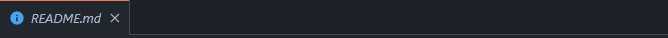

# go-touch-grass README

Simple extension to remember you to get a breake

## Features

\!\[feature X\]\(images/feature-x.png\)

> 

## Extension Settings

Include if your extension adds any VS Code settings through the `contributes.configuration` extension point.

For example:

This extension contributes the following settings:

* `Ctrl + shift + p` --> `Timer`  --> `Time on input box`

***
Example:

>  put the number, like: **2h**
>
> `Ctrl + shift + P` --> Init or press the button init
## Known Issues
Found some issue? DM me on discord! Tag: **WhoisA.js#0001**

**Enjoy!**
